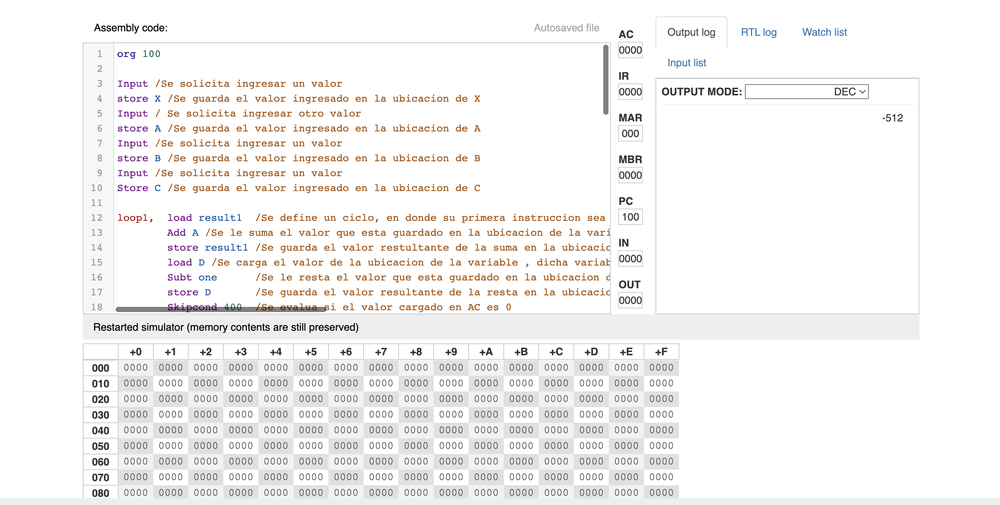
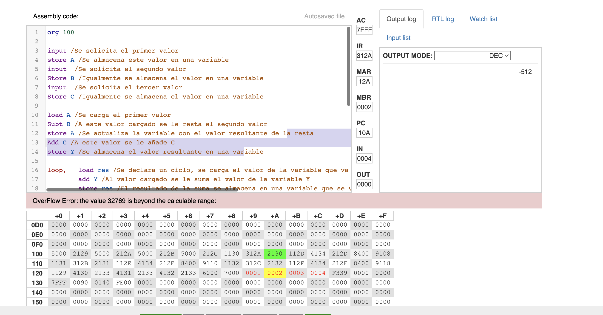
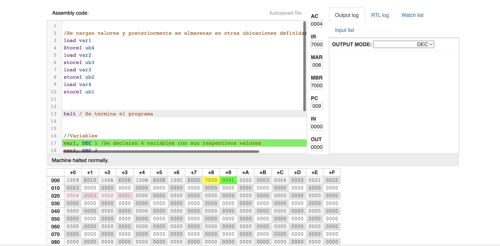
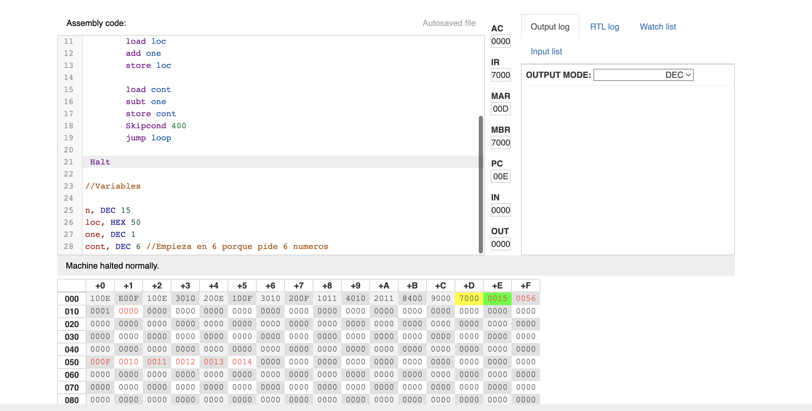
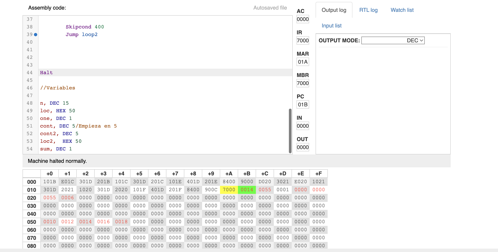
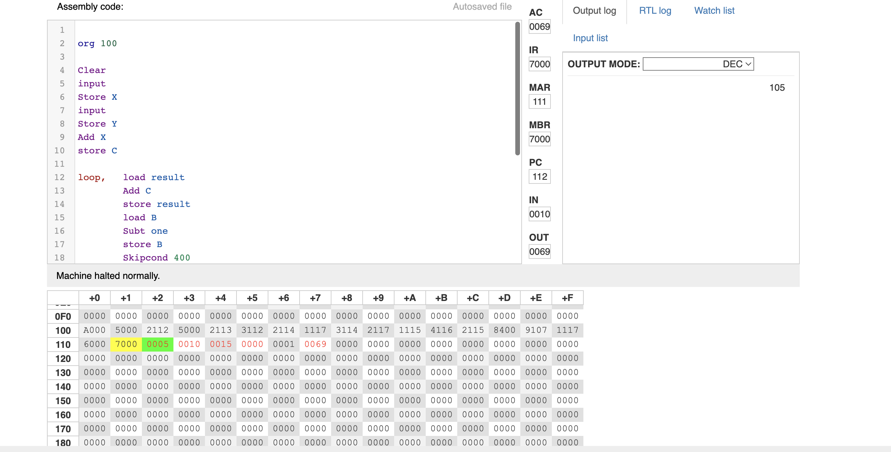

#   Introduction to Assembly Language

## Description
This repository contains the main exercises carried out in order to understand the principles of assembly language and logic.

## Main Learnings 
* CPU organizations and its set of operations
* Memory Sistem Hierarchy 
* Cache Memory Function

## Screenshots
 
